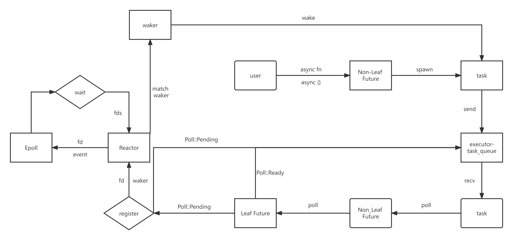

# 异步运行时

在前面的章节中，我们讲到过异步运行时负责调度执行使用者创建的 `Future`，那么异步运行时到底是如何工作的呢？在本章中，我们将会实现一个简单的单线程异步运行时，提供异步的网络IO读写操作，以探讨运行时的具体工作机制。

在正式开始之前，我们首先明确一下即将实现的运行时的工作原理：

1. 用户使用 `async fn` 或者 `async {}` 的方式创建 `Non-Leaf Future`，然后使用 `spawn` 方法创建一个异步 `task`，并将这个 `task` 发送到 `executor` 的任务队列中。

   

2. `executor` 从 `task_queue` 中取出 `task`，调用`task` 的 `poll` 方法，驱动 `Non-Leaf Future` 开始执行（如果已经开始执行了，则从上次的 `await` 断点处继续执行），就这样一直执行 `Future` 中的代码，直到遇到 `Leaf Future.await`。

   

3. 调用 `Leaf Future` 的 `poll` 方法，如果 `Leaf Future` 对应的IO事件已经就绪，则直接返回 `Poll::Ready(data)`；如果对应的IO事件没有就绪，则调用 `Reactor` 的 `register` 方法注册等待的IO事件和 `waker`，然后 `Poll::Pending`（`Non-Leaf Future` 将会被挂起），`executor` 可以继续执行其他的 `task`。

   

4. `Reactor` 会把注册的文件描述符 `fd`、`waker` 保存在`BTreeMap<fd, waker>` 中，然后调用 `Epoll` 提供的方法注册在 `fd` 上想要等待的 `event` 到 `Epoll` 系统中。

   

5. `Reactor` 调用 `Epoll` 提供的 `wait` 方法获取所有就绪的文件描述符 `fds`，然后遍历 `fds`，通过 `fd` 匹配之前在 `BTreeMap` 中存储的 `waker`，然后调用 `waker` 的 `wake` 方法把 `task` 发送到 `executor` 的执行队列中，这样之前挂起的 `Non-Leaf Future` 就能够继续执行了。

   

通过上面的原理讲解我们可以知道，异步代码之所以高效的原因就是避免了IO对线程的阻塞：

* 当执行一个 `task` 时，如果遇到了没有就绪的 IO 操作，就注册 `waker` 到 `Reactor` 中，然后挂起这个 `task`，`executor` 就可以继续执行其他的 `task`。

* 当 `task` 等待的 IO 事件就绪时，`Reactor` 就会通过 `waker` 唤醒关联的 `task`，然后就可以执行之前挂起的 `task` 了。
